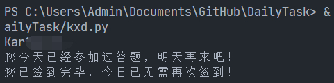

科学刀签到、答题脚本，支持多账户<br/><br/>
支持本地运行、青龙运行<br/><br/>
本地运行时填写代码中的cookies，青龙运行时添加环境变量kxd_ck，多账户用#号分隔<br/><br/>

cookie格式：
G1NZ_2132_saltkey=xxxx;G1NZ_2132_auth=xxxxx;

本地运行cookie示例：<br/>
```
  cookies = [
    "G1NZ_2132_saltkey=示例示例;G1NZ_2132_auth=示例示例;",
    "G1NZ_2132_saltkey=示例示例2;G1NZ_2132_auth=示例示例2;",
  ]
```
<br/>
运行结果：


